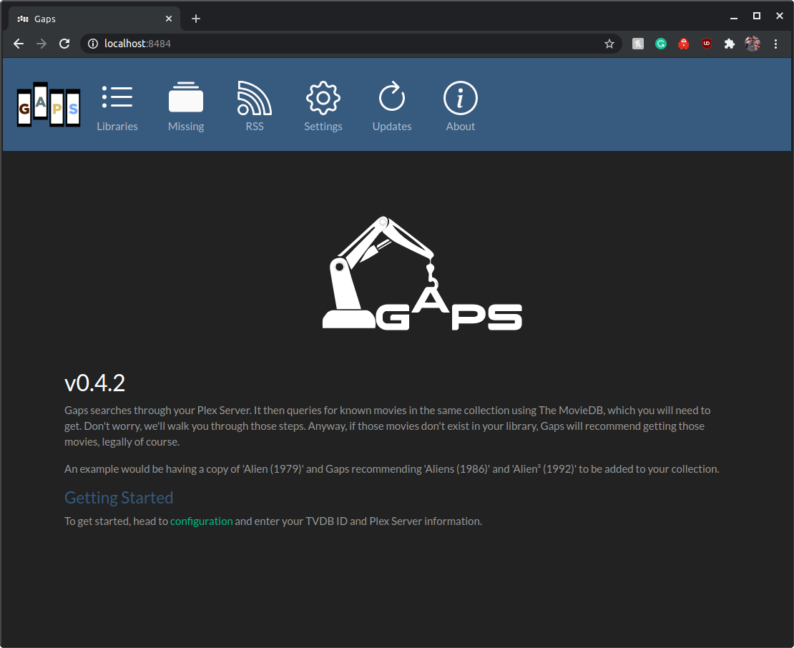
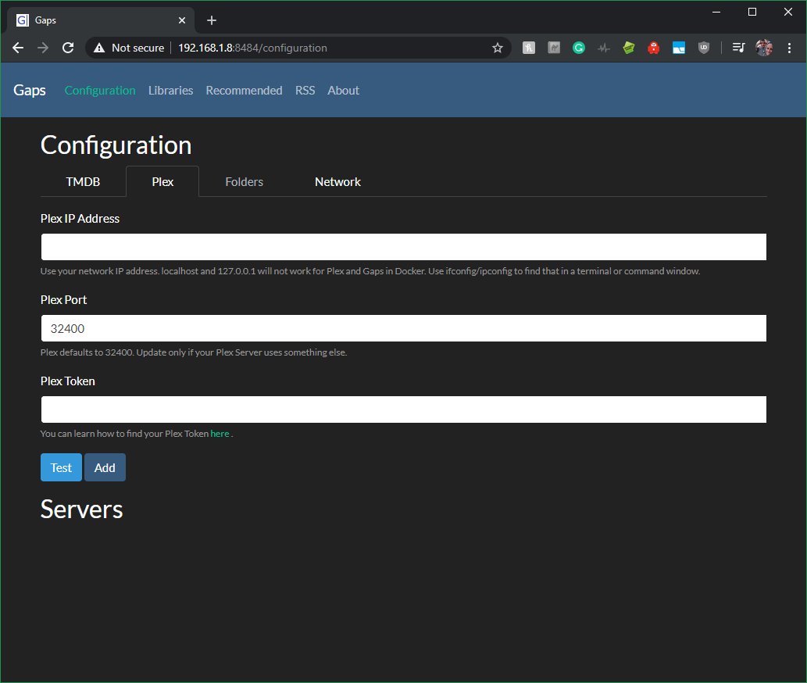
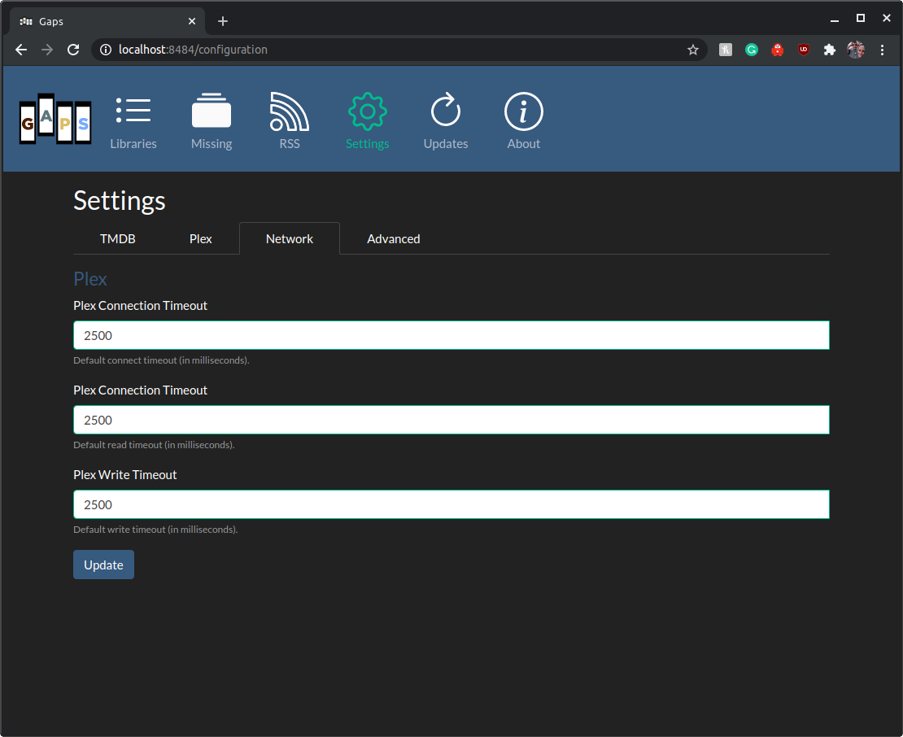
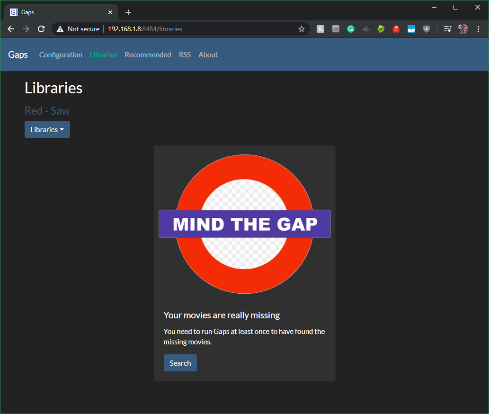
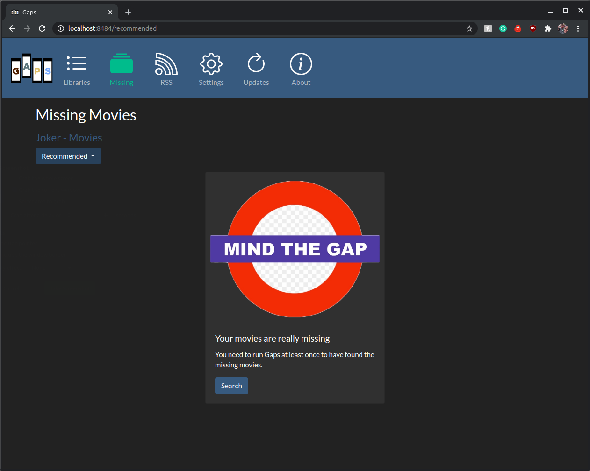
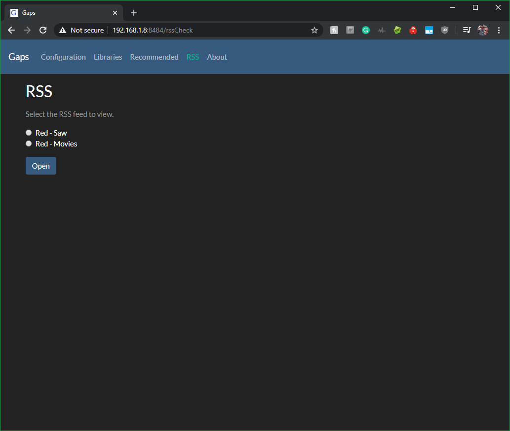

<p align="center">
  <a href="" rel="noopener">
 </a>
</p>

<h3 align="center">Gaps</h3>

<div align="center">

  []() 
  [](https://github.com/JasonHHouse/Gaps/issues)
  [](https://github.com/JasonHHouse/Gaps/pulls)
  [](/LICENSE)

</div>

---

<p align="center"> Gaps searches through your Plex Server or local folders for all movies, then queries for known movies in the same collection. If those movies don't exist in your library, Gaps will recommend getting those movies, legally of course.
    <br> 
</p>

## 📝 Table of Contents
- [About](#about)
- [Getting Started](#getting_started)
- [Deployment](#deployment)
- [Usage](#usage)
- [Built Using](#built_using)
- [TODO](../TODO.md)
- [Contributing](../CONTRIBUTING.md)
- [Authors](#authors)
- [Acknowledgments](#acknowledgement)

## 🧐 About <a name = "about"></a>
Gaps is a FOSS application. An example of Gaps running would be having a copy of 'Alien (1979)' and Gaps recommending 'Aliens (1986)' and 'Alien³ (1992)' to be added to your collection.

## 🏁 Getting Started <a name = "getting_started"></a>
These instructions will get you a copy of the project up and running on your local machine for development and testing purposes. See [deployment](#deployment) for notes on how to deploy the project on a live system.

### Prerequisites
What things you need to install the software and how to install them.

#### Option 1 
<code>
Gaps can run in <a href="https://www.docker.com/">Docker</a>. If you choose to run this way, you'll need a Docker environment installed. Docker has a good write up on installing Docker CE. Check it out <a href="https://docs.docker.com/install/">here</a>. Once you get docker up and running
</code>

#### Option 2
<code>
Gaps can run as an exe on Windows. GapsOnWindows can be found on the <a href="https://github.com/JasonHHouse/gaps/releases">releases</a> page. Gaps-{version}.zip.
</code>

### Installing
With Docker installed, you'll need to now pull down the latest Gaps image. The Gaps image is hosted [here](https://hub.docker.com/r/housewrecker/gaps). To pull the image, run the following command in a terminal

If you are running an x86 machine, use this command.

```
docker pull housewrecker/gaps:latest
```

If you are running an ARM machine, use this command.

```
docker pull housewrecker/gaps:arm-latest
```

With the image pulled, now you can run the container. 

_Note: 8484 is used internally by gaps. Externally, any available host port can be used. This can be configured by changing -p {valid port number}:8484_

```
docker run -d -p 8484:8484 --name mygaps --expose 32400 -v /{localFolder}/gaps:/usr/data housewrecker/gaps:latest
```

Open your browser and navigate to, http://{IP_ADDRESS}:8484

If everything worked, you will be greeted by the gaps home page.



## 🎈 Usage <a name="usage"></a>

### Home Page


Click the *Settings* tab to set up Gaps. 

### Settings

#### TMDB

First you need to enter your The Movie Database (TMDB) Api Key. As noted on the page, to use Gaps, you'll need a MovieDB api key. Navigate over to [The Movie DB](https://www.themoviedb.org/settings/api), create an account, and make an API Key. Copy that key and paste it below.

With your TMDB key added, now you need to configure the information to connect to Plex.

Click the *Test* button to confirm your key works.

Click the *Save* button to add your key.

Click the *Plex* tab to set up Gaps. 

#### Plex



Now you'll need to configure how to connect Gaps to Plex. This includes three main things: the host/ip address of Plex, the port Plex uses, and your personal Plex Token.

The host/ip address and port are the same ones you use to connect to Plex via the web. It could look something like this

    https://localhost:32400/web/index.html
    
Or

    https://127.0.0.1:32400/web/index.html
    
If Plex and Gaps are both running in the same Docker, you may need to use the IP address on the local network. Example 

    https://192.168.1.10:32400/web/index.html

So, in the first case the host is localhost and the port 32400. In the second case, the host is 127.0.0.1 with the same port.

Lastly, you'll need to get your personal Plex Token. If you do not know already it's easy to find. Plex has a great write up [here](https://support.plex.tv/articles/204059436-finding-an-authentication-token-x-plex-token/) about how to find your token.

Click the *Test* button to confirm your Plex server configuration works.

Click the *Save* button to add your Plex server.

#### Folders

*Note: Right now only searching via Plex is working. In time, I'll add back in searching by folder.*

#### Network



Increase the timeout if Plex connection is on a remote network and timeouts are occurring.

### Libraries

Click the *Libraries* tab to set up Gaps.

*If you have more than one Movie Library or Plex Server, the dropdown lets you pick the Server and Library to search from.*  



Click the *Search* button find your Plex Movies.


Gaps will display the movies found in the Plex Server Library.

*Note: Rerun this step for each server you want Gaps to find the missing movies in.*

Click the *Recommended* tab to set up Gaps.

### Missing
Once you've started searching, the movies will start populating on the final page.

 

Click the *Search* button find your missing movies.

 

For large libraries, this can take a while to run. The results are stored and only need to be rerun when Plex updates. Missing movies are added as found. Do not navigate away. Gaps will still run but you'll have to check logs to know when it is complete. It is currently easier to just leave the page open. Fixes for this are coming soon.

### Recommended and RSS

 

Once you've completed at least one search of your plex libraries, you can then view and use the output as RSS.

## ⛏️ Built Using <a name = "built_using"></a>
- [jQuery](https://jquery.com/) - JS Framework
- [Bootstrap](https://getbootstrap.com/) - UI Framework
- [Spring Boot](https://spring.io/projects/spring-boot) - Server Framework
- [NodeJs](https://nodejs.org/en/) - Testing and Build Environment

## ✍️ Authors <a name = "authors"></a>
- [@JasonHHouse](https://github.com/JasonHHouse) - Idea & Initial work

## 🎉 Acknowledgements <a name = "acknowledgement"></a>
- [@Knoxie](https://github.com/knoxie) Developer, testing, and support
- Inspiration
    - A missing feature from Plex