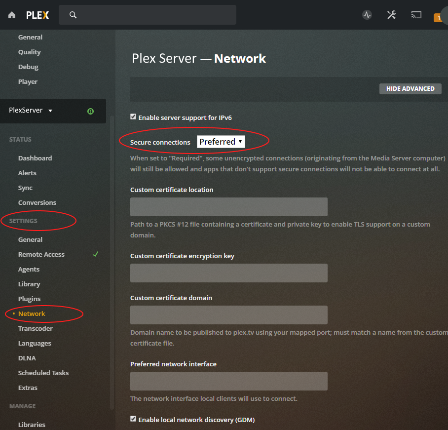
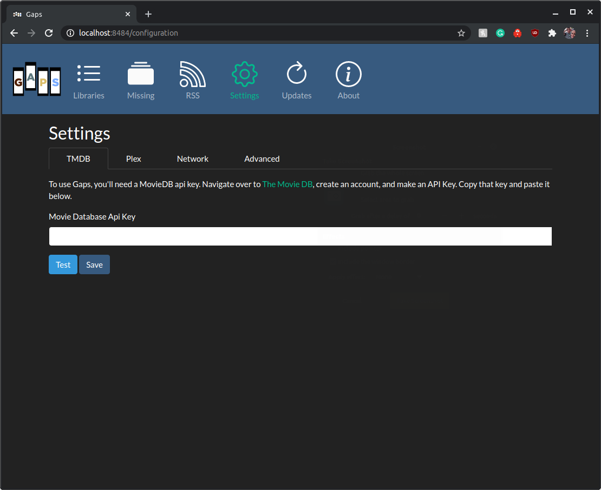
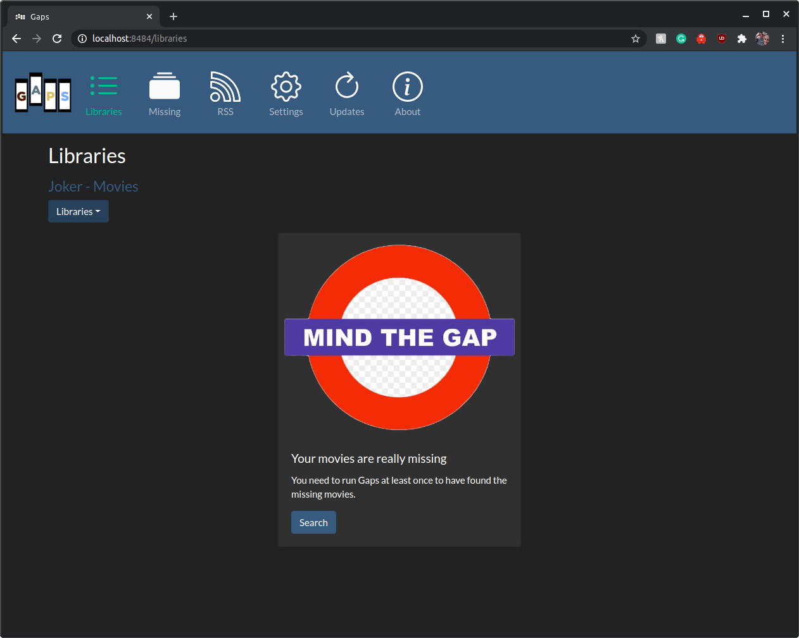
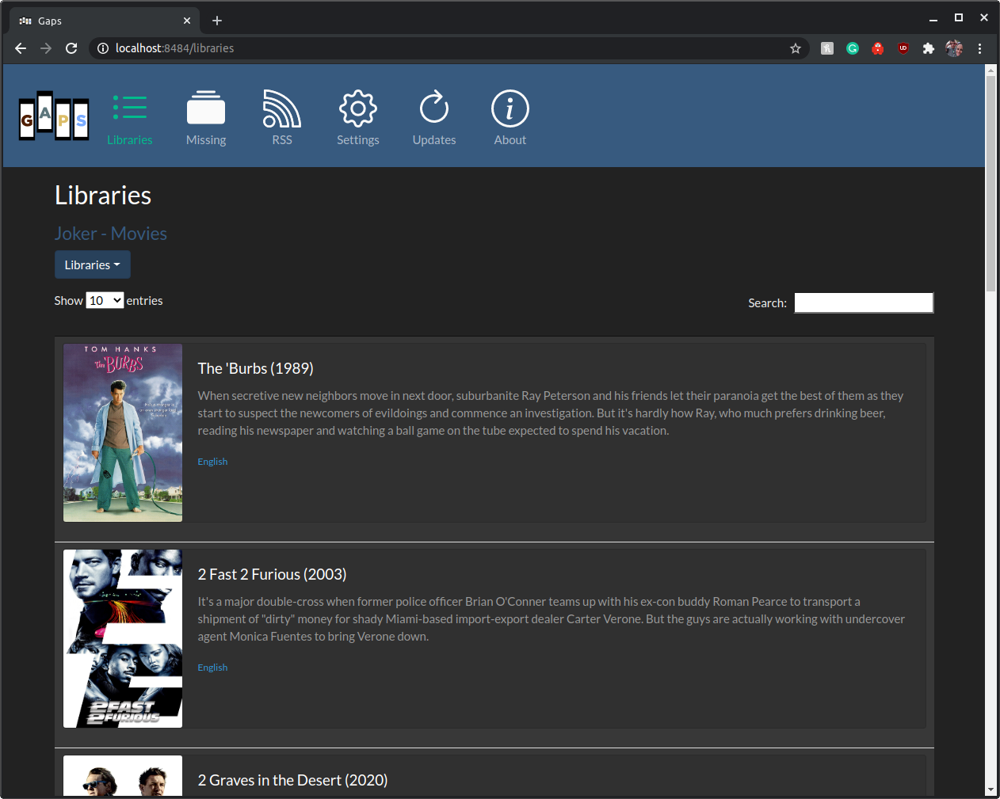
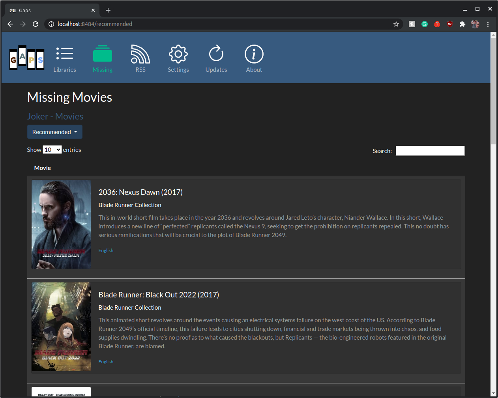
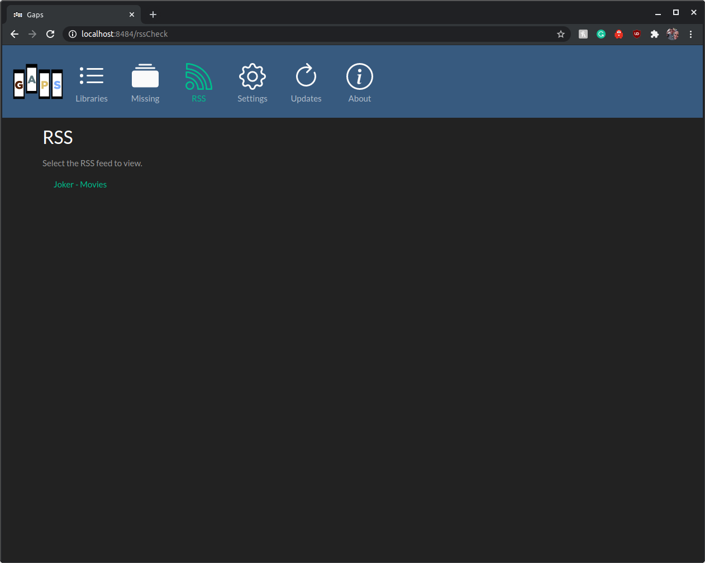

# Gaps
Gaps searches through your Plex Server or local folders for all movies, then queries for known movies in the same collection. If those movies don't exist in your library, Gaps will recommend getting those movies, legally of course.

## Setup
### Plex
For Gaps to communicate with Plex you may need to adjust your network settings.

    Network Settings | Secure connections set to Preferred

### Docker

Gaps runs in [Docker](https://www.docker.com/), so you'll need a basic ability to download and run a container. If you already have Docker, skip to installing and running.

*Underneath the covers, Gaps runs as a Spring Boot app. Don't worry about it though. The container will pull down Java for you and automatically run the jar.* 

Docker has a good write up on installing Docker CE. Check it out [here](https://docs.docker.com/install/). Once you get docker up and running

## Installing and Running

With Docker installed, you'll need to now pull down the latest Gaps image. The Gaps image is hosted [here](https://hub.docker.com/r/housewrecker/gaps).

To pull the image, run the following command in a terminal

    docker pull housewrecker/gaps

You now have the Gaps image and you need to do a little configuration. The command to run Gaps follows

    docker run -d -p 8484:8484 --name mygaps --expose 32400 -v /{localFolder}/gaps:/usr/data housewrecker/gaps:latest
    
* For Unraid see the wiki: https://github.com/JasonHHouse/Gaps/wiki
* For persistent runs when you updated Gaps, it is recommended to set a local folder for gaps to write to
* For Radarr list import, see https://github.com/JasonHHouse/Gaps/wiki/Radarr-List
### Important Notes

1. -p or publish exposes maps ports from the container to the outside world. Docker has a great write up [here](https://docs.docker.com/config/containers/container-networking/). 

    *Note: If 8484 is in use on your system, change the publish command to -p <new available port>:8484*

2. --name mygaps sets the name of the local running container. You can change it to whatever you want, just don't forget the name in the future!

3. --expose 32400 is there to communicate with Plex. By default, Plex is set to 32400 by default. If you've changed the port, change that here. 

Once all those values are updated correctly for your system, you can run the command and Gaps will start up.

To track the logs from Gaps, use the following command. Again, change the container, if you changed the name.

     docker logs -f mygaps

## Usage

To see Gaps, open up your browser and navigate over to the ip address and port you set for Gaps.

If your browser is on the same machine running Docker and you did not change the port, then you can navigate to

#### HTTPS 
1. https://{IP_ADDRESS}:8484
2. https://127.0.0.1:8484

#### HTTP
1. http://{IP_ADDRESS}:8484
2. http://127.0.0.1:8484

### Home Page

Click the *Configuration* tab to set up Gaps. 

### Configuration

#### TMDB

First you need to enter your The Movie Database (TMDB) Api Key. As noted on the page, to use Gaps, you'll need a MovieDB api key. Navigate over to [The Movie DB](https://www.themoviedb.org/settings/api), create an account, and make an API Key. Copy that key and paste it below.

With your TMDB key added, now you need to configure the information to connect to Plex.

Click the *Test* button to confirm your key works.

Click the *Save* button to add your key.

Click the *Plex* tab to set up Gaps. 

#### Plex

Now you'll need to configure how to connect Gaps to Plex. This includes three main things: the host/ip address of Plex, the port Plex uses, and your personal Plex Token.

The host/ip address and port are the same ones you use to connect to Plex via the web. It could look something like this

    https://localhost:32400/web/index.html
    
Or

    https://127.0.0.1:32400/web/index.html
    
If Plex and Gaps are both running in the same Docker, you may need to use the IP address on the local network. Example 

    https://192.168.1.10:32400/web/index.html

So, in the first case the host is localhost and the port 32400. In the second case, the host is 127.0.0.1 with the same port.

Lastly, you'll need to get your personal Plex Token. If you do not know already it's easy to find. Plex has a great write up [here](https://support.plex.tv/articles/204059436-finding-an-authentication-token-x-plex-token/) about how to find your token.

Click the *Test* button to confirm your Plex server configuration works.

Click the *Save* button to add your Plex server.

#### Folders

*Note: Right now only searching via Plex is working. In time, I'll add back in searching by folder.*

#### Network

Increase the timeout if Plex connection is on a remote network and timeouts are occurring.

### Libraries

Click the *Libraries* tab to set up Gaps.

*If you have more than one Movie Library or Plex Server, the dropdown lets you pick the Server and Library to search from.*  

Click the *Search* button find your Plex Movies.

Gaps will display the movies found in the Plex Server Library.

*Note: Rerun this step for each server you want Gaps to find the missing movies in.*

Click the *Recommended* tab to set up Gaps.

### Recommended
Once you've started searching, the movies will start populating on the final page.

 

Click the *Search* button find your missing movies.

 

For large libraries, this can take a while to run. The results are stored and only need to be rerun when Plex is updated. Missing movies are added as found. Do not navigate away. Gaps will still run but you'll have to check logs to know when it is complete. It is currently easier to just leave the page open. Fixes for this are coming soon.

### Recommended and RSS

 

Once you've completed at least one search of your plex libraries, you can then view and use the output as RSS.

## License
Copyright 2019 Jason H House

Permission is hereby granted, free of charge, to any person obtaining a copy of this software and associated documentation files (the "Software"), to deal in the Software without restriction, including without limitation the rights to use, copy, modify, merge, publish, distribute, sublicense, and/or sell copies of the Software, and to permit persons to whom the Software is furnished to do so, subject to the following conditions:

The above copyright notice and this permission notice shall be included in all copies or substantial portions of the Software.

THE SOFTWARE IS PROVIDED "AS IS", WITHOUT WARRANTY OF ANY KIND, EXPRESS OR IMPLIED, INCLUDING BUT NOT LIMITED TO THE WARRANTIES OF MERCHANTABILITY, FITNESS FOR A PARTICULAR PURPOSE AND NONINFRINGEMENT. IN NO EVENT SHALL THE AUTHORS OR COPYRIGHT HOLDERS BE LIABLE FOR ANY CLAIM, DAMAGES OR OTHER LIABILITY, WHETHER IN AN ACTION OF CONTRACT, TORT OR OTHERWISE, ARISING FROM, OUT OF OR IN CONNECTION WITH THE SOFTWARE OR THE USE OR OTHER DEALINGS IN THE SOFTWARE.

